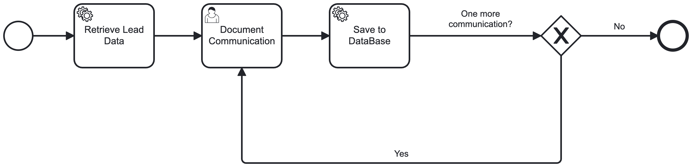
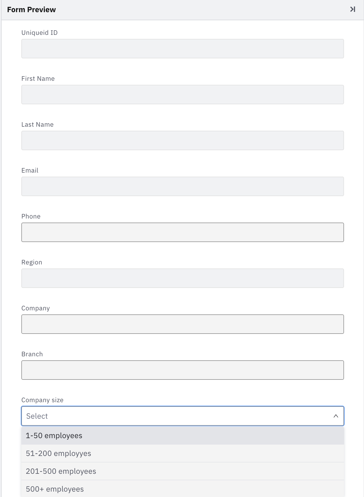
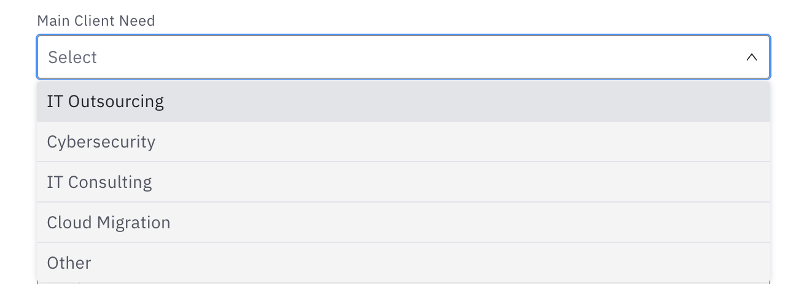
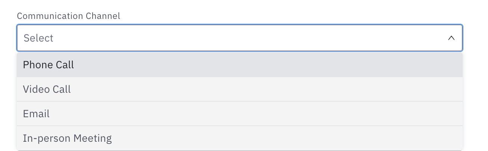
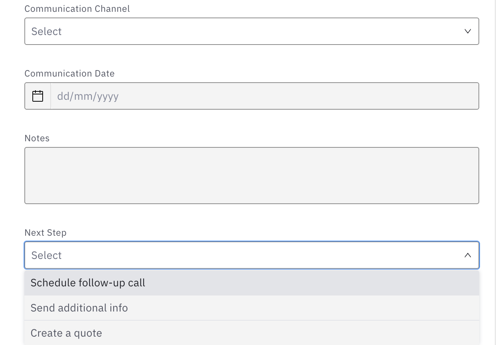
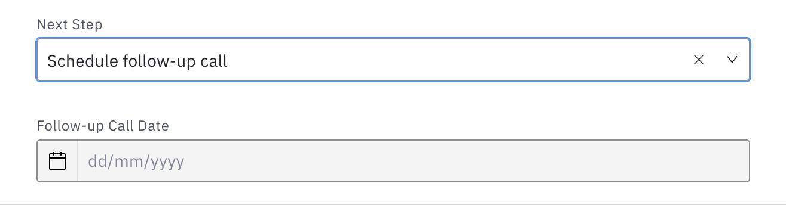
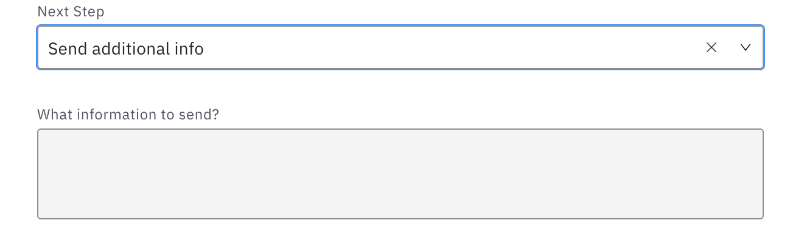

# Team Zoo Zürich

# SS26_AlpineTech_Solutions
## Table of Contents

* [Project Members](#project-members)
* [1. Introduction](#1-introduction)
* [2. Problem Description](#2-problem-description)
  * [2.1 AS-IS Process Overview](#21-as-is-process-overview)
    * [Key Limitations of the AS-IS Process](#key-limitations-of-the-as-is-process)
    * [AS-IS BPMN Diagram](#as-is-bpmn-diagram)
    * [Project Focus: Digitalisation of the First Part of the Process](#project-focus-digitalisation-of-the-first-part-of-the-process)
* [3. Project Objective](#3-project-objective)
* [4. Digitalisation Approach: AS-IS vs. TO-BE](#4-digitalisation-approach-as-is-vs-to-be)
* [5. TO-BE Process](#5-to-be-process)
  * [5.1 Register a Lead](#51-register-a-lead)
  * [5.2 Choose Sales Representative and Assign Lead](#52-choose-sales-representative-and-assign-lead)
  * [5.3 Send Email with Available Consultation Slots](#53-send-email-with-available-consultation-slots)
  * [5.4 Specify Needs with Client](#54-specify-needs-with-client)
  * [5.5 Create a Quote](#55-create-a-quote)

## Project members

### Project Team / Authors

| Name | Email |
| :--- | :--- |
| Robin Kaefer | [robin.kaefer@students.fhnw.ch](mailto:robin.kaefer@students.fhnw.ch) |
| Kateryna Shevelieva | [kateryna.shevelieva@students.fhnw.ch](mailto:kateryna.shevelieva@students.fhnw.ch) |
| Sofiia Irfan Pasha | [sofiia.irfanpasha@students.fhnw.ch](mailto:sofiia.irfanpasha@students.fhnw.ch) |
| Kateryna Hrebeniuk | [kateryna.hrebeniuk@students.fhnw.ch](mailto:kateryna.hrebeniuk@students.fhnw.ch) |
| Nataliia Zinovieva | [nataliia.zinovieva@students.fhnw.ch](mailto:nataliia.zinovieva@students.fhnw.ch) |

### Supervisors

| Name | Email |
| :--- | :--- |
| Andreas Martin | [andreas.martin@fhnw.ch](mailto:andreas.martin@fhnw.ch) |
| Charuta Pande | [charuta.pande@fhnw.ch](mailto:charuta.pande@fhnw.ch) |
| Devid Montecchiari | [devid.montecchiari@fhnw.ch](mailto:devid.montecchiari@fhnw.ch) |

## 1. Introduction

AlpineTech Solutions is a Swiss-based technology company headquartered in Olten. The company provides IT services for small and medium-sized enterprises across Switzerland, Germany, and Austria. With approximately 200 employees, including a sales department of 10 representatives, AlpineTech Solutions has experienced rapid growth over the past three years.

As the company expanded its customer base and sales activities, the existing tools used to manage sales processes have become increasingly inefficient. Currently, AlpineTech Solutions relies on spreadsheets, email communication, and shared documents to track leads, manage customer interactions, and monitor sales opportunities. These fragmented tools create operational inefficiencies, chaos in processes and limit visibility into sales performance.

To address these challenges, AlpineTech Solutions has initiated a project to select and implement a Customer Relationship Management (CRM) system that will support the digitalisation and automation of its sales processes.

---

## 2. Problem Description

The sales department currently manages leads, customer information, and sales opportunities using Excel files stored in shared drives. Each sales representative maintains their own tracking files, which leads to inconsistent data, duplicated work, and poor coordination between team members.

Furthermore, communication with customers is handled primarily through email without a centralized record of interactions. As a result, when sales representatives are absent or accounts are reassigned, valuable information about client conversations and negotiations is often lost.

Sales managers also face difficulties obtaining an accurate overview of the sales pipeline. Weekly sales reports are manually compiled from different spreadsheets, manual presentation creature which consumes considerable time and often leads to outdated or inaccurate forecasts.

These issues have resulted in several operational problems:

- Sales leads are not centrally managed.
- Multiple representatives sometimes contact the same prospect.
- Customer interaction history is incomplete or totally missing.
- Quote generation and proposal preparation require manual work.
- Sales managers lack real-time visibility into deal progress.
- Reports and client presentations are done manually.

To improve efficiency and support future growth, AlpineTech Solutions's management has decided to introduce a CRM system that centralizes sales data and automates key sales activities.

### 2.1 AS-IS Process Overview

The current sales process at AlpineTech Solutions involves three internal roles — **Sales Representative**, **Sales Manager**, and **Technical Team** — coordinating with the **Customer** through a shared corporate email inbox.

**Process Flow:**

1. **Lead Registration** — A customer sends a request to the shared corporate email. The Sales Representative manually registers the lead by recording the client's contact details into a personal Excel file.

2. **Needs Definition** — The Sales Representative contacts the client to clarify their requirements and determine whether the client is interested in proceeding.

3. **Quote Creation** — If the client is interested, the Sales Representative manually creates a quote document in Word/Excel, which is then exported to PDF.

4. **Quote Verification** — The quote is reviewed by the Sales Manager. If the quote is not approved, it is returned to the Sales Representative for updates. This loop continues until the quote is approved.

5. **Quote Delivery** — The approved quote is sent to the client via Gmail.

6. **Client Decision** — The client's response is received by email. The Sales Representative manually checks the answer:
   - If the answer is **negative** — the client's row in Excel is marked red and the process ends (rejected).
   - If the answer is **positive** — the Sales Representative prepares and sends an invoice via Gmail.

7. **Project Handover** — The Sales Representative hands the project over to the Development Team. In parallel, the Technical Team creates and delivers the product to the client, while the system waits for the payment confirmation.

8. **Completion** — Once the product is delivered and payment is received, the client's row in Excel is marked green and the process ends successfully (*Customer onboarded / Project complete*).

**Tools currently used:**

| Step | Tool |
|---|---|
| Lead tracking | Excel (individual files per Sales Rep) |
| Quote preparation | Microsoft Word / Excel → PDF |
| Communication | Shared corporate Gmail inbox |
| Status tracking | Excel (manual color-coding: red = rejected, green = onboarded) |

#### Key Limitations of the AS-IS Process

- No centralised lead management — each Sales Representative maintains separate Excel files, leading to duplicates and data loss.
- All communication is handled through a shared inbox with no history tracking, meaning information is lost when staff are reassigned or absent.
- Quote and invoice preparation is entirely manual, consuming significant time and introducing inconsistencies.
- There is no structured follow-up mechanism — if a client does not respond, there is no automated re-engagement path.
- Sales Managers have no real-time pipeline visibility; status reporting requires manual consolidation from multiple spreadsheets.
- Client status is tracked by manually changing cell colors in Excel, which is error-prone and unscalable.

#### AS-IS BPMN Diagram

The diagram below shows the full AS-IS sales process at AlpineTech Solutions:

The full process model can be viewed and edited in Camunda Modeler:
[Alpine Tech Solutions — AS-IS process (BPMN)](resources/bpmn_models/Alpine%20Tech%20Solutions_AS-IS%20process.bpmn)

#### Project Focus: Digitalisation of the First Part of the Process

While the AS-IS process covers the entire sales lifecycle, **this project focuses on the digitalisation of the process from the moment a lead request is received through to the creation of a quote**. This scope covers lead registration, lead assignment, consultation scheduling, needs definition, and quote creation — the steps with the highest concentration of manual effort, coordination overhead, and risk of data loss.

---

## 3. Project Objective

The problems identified in the AS-IS process — fragmented data, manual coordination, and lack of visibility — require a structured digitalisation of the sales process. The goal of this project is to automate and centralise the steps **from the moment a lead request is received through to the creation of a quote**, eliminating manual overhead and reducing the risk of data loss.

The solution targets the following outcomes:

- Centralised, real-time lead tracking replacing individual Excel files
- Automated lead assignment based on predefined rules (region, workload)
- Automated scheduling and follow-up reminders to prevent leads from stalling
- Structured quote generation with manager approval flow
- Full interaction history accessible to the entire sales team

---

## 4. Digitalisation Approach: AS-IS vs. TO-BE

The table below maps each identified bottleneck from the AS-IS process to its automated counterpart in the TO-BE implementation:

| Process Step | AS-IS (Manual) | TO-BE (Automated) |
| :--- | :--- | :--- |
| **Lead Registration** | Manual entry into individual Excel files; duplicates and data loss common. | Leads captured via contact form and stored instantly in a centralised CRM database via API. |
| **Lead Assignment** | Manual decision by the Sales Manager; slow and inconsistent. | Automatic routing to the responsible Sales Representative using a **DMN decision table** (region / workload). |
| **Consultation Scheduling** | No formal step — slots shared manually by email. | Automated booking link (Cal.com) sent via Gmail; confirmation received via webhook and injected into the process. |
| **Needs Definition** | Information gathered verbally during a call; stored in personal notes or Excel with no shared access. If the Sales Rep was absent, context was lost and the client had to repeat themselves. | A structured **Camunda User Task form** is filled by the Sales Rep during the call. Data is pulled from and saved to the central database, making the full client context available to any team member. The step repeats in a **loop** across multiple interactions until the client confirms their requirements — only then does the process advance to quote creation. |
| **Quote Generation** | Manual creation in Word/Excel, exported to PDF; inconsistent and time-consuming. | Quote generated automatically from a predefined template based on inputs collected during needs definition. |
| **Communication Tracking** | Fragmented Gmail threads; history lost when staff are absent or reassigned. | All interactions logged centrally in the CRM and accessible to the full sales team. |

## 5. TO-BE Process

The TO-BE process replaces the fragmented, manual workflow with a centralised, automated sales pipeline orchestrated through **Camunda BPMN**. The digitised scope covers the full journey from an incoming lead request to the creation of a quote.

The full TO-BE process model can be viewed and edited in Camunda Modeler:
[Alpine Tech Solutions — TO-BE process (BPMN)](resources/bpmn_models/Alpine%20Tech%20Solutions_TO-BE%20process.bpmn)

---

### 5.1 Register a Lead

The client fills in a Google Form that captures all required lead information (name, company, contact details, region, and a brief description of their needs). Google Forms directly addresses this by capturing structured data automatically, eliminating the manual entry step that causes duplicates and data loss. There is no learning curve both the sales team managing the form and clients filling it in are likely already familiar with Google Forms.

Integration Flow

Client submits the Google Form, the submission is recorded in the linked Google Sheet automatically.
Make  triggers on new row a Make scenario monitors the Google Sheet for new entries. As soon as a new row appears (i.e. a form submission), it fires.
Make sends the data to the CRM, the scenario maps the form fields to the CRM database fields and creates a new lead record via API call.
Camunda process instance is started, Make also triggers the Camunda REST API to start a new process instance, passing the lead data as process variables.
Process continues to step 5.2 the lead is now registered centrally and the DMN decision table can assign it to the right Sales Representative.

### 5.2 Choose Sales Representative and Assign Lead

Once the lead is registered, the process triggers an automated routing mechanism to select the most appropriate Sales Representative. This eliminates the need for the Sales Manager to manually distribute new leads.

**Automated Routing (Service Task):**
Instead of a static DMN table, the system uses a dynamic, event-driven integration via **Make.com**. 
* **Trigger:** The Camunda process sends a payload containing the `leadId` to a Custom Webhook in Make.com.
* **Intelligent Selection:** Make.com executes an advanced SQL query against the PostgreSQL CRM database. By joining multiple tables (`employee`, `lead`, `customer`, `specialization`), the system prioritizes and selects the best representative based on three dynamic factors:
  1. **Region Matching:** Prioritizes employees matching the customer's region.
  2. **Specialization Matching:** Prioritizes employees matching the customer's industry branch.
  3. **Workload Balancing:** Calculates the number of active leads assigned to each matching employee and selects the one with the lowest count, ensuring an even distribution of work.
* **Direct Database Update & Process Continuation:** Once the optimal representative is identified, Make.com executes an `UPDATE` statement directly on the CRM database to link the lead to the assigned employee. A Webhook Response then sends the `employeeId` back to Camunda, which instantly triggers the next step (sending the automated appointment request).

### 5.3 Send Email with Available Consultation Slots

Once the lead has been assigned to a Sales Representative in step 5.2, the process advances to scheduling a consultation call. In the AS-IS process, slots were proposed manually by email, which created long back-and-forth threads and frequent conflicts. In the TO-BE process this step is fully automated: a **Service Task** in Camunda sends the client a Gmail containing a personal **Calendly** booking link, and the client self-books a slot directly into the assigned Sales Representative's live calendar.

---

#### BPMN Element

In the BPMN model, this step is implemented as a single **Service Task** named **`Send email with available consultation slots`** in the *Sales Representative* lane. It sits between the user task *Assign Lead to Sales Rep.* and the user task *Specify Needs with Clients*. The task is automated — no human action is required inside Camunda; the rest of the work happens externally in Make.com, Gmail, and Calendly. The outcome (the actual meeting booking by the client) is sent back to the assigned Sales Representative's calendar by Calendly, so the rep is ready to start *Specify Needs with Clients* at the agreed time.

---

#### Integration Flow

**1. Camunda triggers the Service Task.**
After *Assign Lead to Sales Rep.* writes the `employeeId` of the assigned Sales Representative into the CRM, the Service Task `Send email with available consultation slots` fires. It sends a payload to a Custom Webhook in **Make.com** containing:
- `leadId`
- `clientName`
- `clientEmail`
- `employeeId` (the assigned Sales Representative)

**2. Make.com resolves the correct Calendly link.**
The Make scenario queries the CRM (PostgreSQL `employee` table) for the assigned Sales Representative and retrieves their personal **Calendly event link** (e.g. `https://calendly.com/alpinetech-john/30min-consultation`). Each Sales Rep has a dedicated Calendly event type connected to their own Google/Outlook calendar, so the booking always lands with the right person.

**3. Make.com sends the Gmail.**
Using the Gmail module, Make composes and sends a personalised email to the client containing:
- A short introduction from the assigned Sales Representative
- The Calendly booking link
- The purpose and expected duration of the call
- A fallback contact for any issues with the link

**4. Client self-books a slot in Calendly.**
Because Calendly is connected directly to the rep's calendar, only genuinely free slots are exposed. The client picks a time and confirms. Calendly automatically:
- Creates the calendar event in the rep's Google/Outlook calendar
- Sends confirmation and reminder emails to both the client and the rep
- Generates the meeting link (e.g. Google Meet / Zoom) and adds it to the invite

**5. Process advances to step 5.4.**
Once the email has been dispatched by the Service Task, Camunda continues immediately to *Specify Needs with Clients*. The booking itself is handled outside Camunda by Calendly, so when the time of the call arrives, the rep simply opens the user task that has been waiting for them and starts the conversation with full context already retrieved from the database (see 5.4).

---

#### Tools and Configuration

| Tool | Role in step 5.3 |
| :--- | :--- |
| **Camunda** | Hosts the Service Task that triggers the integration. |
| **Make.com** | Receives the trigger from Camunda, looks up the rep's Calendly link in the CRM, and sends the email via Gmail. |
| **Gmail** | Delivers the booking email to the client from the corporate domain. |
| **Calendly** | Hosts the per-rep booking pages, exposes only real-time free slots, books the meeting directly into the rep's calendar. |
| **CRM (PostgreSQL)** | Stores each Sales Representative's personal Calendly link in the `employee` table. |

---

#### Setup Steps (One-Time Configuration)

For this step to work end-to-end, the following one-time setup is required:

1. **In Calendly** — for each Sales Representative, create a 30-minute event type called *AlpineTech Consultation* and connect it to their Google/Outlook calendar. Copy the resulting personal link.
2. **In the CRM** — add a `calendly_link` column to the `employee` table and populate it with each rep's link.
3. **In Make.com** — build a scenario with three modules:
   - **Webhook (Custom)** — receives the payload from Camunda.
   - **PostgreSQL → Select rows** — fetches the rep's `calendly_link` and `email` using `employeeId`.
   - **Gmail → Send an email** — sends the booking email to the client, with the Calendly link inserted via Make variables.
4. **In Camunda Modeler** — configure the Service Task `Send email with available consultation slots` as an HTTP connector (or external task) that calls the Make webhook URL with the lead payload.

---

### 5.4 Specify Needs with Client

This step is the core communication loop between the Sales Representative and the client. It is fully integrated with the central database via **Make (Integromat)** and consists of three stages: retrieving existing data, collecting needs through a structured form, and saving everything back to the database.

---

#### Retrieve Lead Data

Before the call begins, **Make Scenario 1** is triggered automatically. It connects Camunda with the database and retrieves all existing information about the lead — contact details, previous interactions, and any data already collected during earlier process steps. This data is injected into the Camunda process instance so the Sales Representative starts the conversation with full context, even if a different rep handled the client previously.

---

#### Document Communication — Camunda Form

During the call, the assigned Sales Representative opens a **Camunda User Task** containing a structured form pre-populated with the retrieved lead data. The rep fills in the client's requirements, preferences, and any relevant notes while the conversation is ongoing. 

The form is divided into multiple sections (Form 1–6), each capturing a specific area of the client's needs:

| | |
|---|---|
|  |  |
|  |  |
|  |  |

---

#### Save to Database

Once the form is submitted, **Make Scenario 2** is triggered. All responses entered by the Sales Representative are automatically saved back to the central database. This ensures that the full communication history is preserved and accessible to any team member at any time — regardless of who conducted the call.

---

#### Communication Loop

Because a client typically requires multiple interactions before confirming their needs, this step runs as a **loop**. After each call, the process returns to the beginning of 5.4 — the rep retrieves the updated data, conducts the next conversation, fills in the form again, and saves the new information. The loop continues until the client's requirements are confirmed.

Once confirmed, the process exits the loop and returns to the main TO-BE flow, where one of two outcomes follows:

- **Lead closed** — the client is not a match; the case is closed in the database.
- **Create a Quote** — the client proceeds, and the process advances to step 5.5.

---

### 5.5 Create a Quote

Once the client has confirmed their requirements, the process advances to quote creation. A quote is generated automatically from a predefined template using the data collected and stored during the needs definition phase, replacing the manual Word/Excel preparation from the AS-IS process.

---

### How It Works

