# Team Zoo Zürich

# SS26_AlpineTech_Solutions
## Table of Contents

* [Project Members](#project-members)
* [1. Introduction](#1-introduction)
* [2. Problem Description](#2-problem-description)
  * [2.1 AS-IS Process Overview](#21-as-is-process-overview)
    * [Key Limitations of the AS-IS Process](#key-limitations-of-the-as-is-process)
    * [AS-IS BPMN Diagram](#as-is-bpmn-diagram)
    * [Project Focus: Digitalisation of the First Part of the Process](#project-focus-digitalisation-of-the-first-part-of-the-process)
* [3. Project Objective](#3-project-objective)
* [4. Digitalisation Approach: AS-IS vs. TO-BE](#4-digitalisation-approach-as-is-vs-to-be)
* [5. TO-BE Process](#5-to-be-process)
  * [5.1 Register a Lead](#51-register-a-lead)
  * [5.2 Choose Sales Representative and Assign Lead](#52-choose-sales-representative-and-assign-lead)
  * [5.3 Send Email with Available Consultation Slots](#53-send-email-with-available-consultation-slots)
  * [5.4 Specify Needs with Client](#54-specify-needs-with-client)
  * [5.5 Create a Quote](#55-create-a-quote)

## Project members

### Project Team / Authors

| Name | Email |
| :--- | :--- |
| Robin Kaefer | [robin.kaefer@students.fhnw.ch](mailto:robin.kaefer@students.fhnw.ch) |
| Kateryna Shevelieva | [kateryna.shevelieva@students.fhnw.ch](mailto:kateryna.shevelieva@students.fhnw.ch) |
| Sofiia Irfan Pasha | [sofiia.irfanpasha@students.fhnw.ch](mailto:sofiia.irfanpasha@students.fhnw.ch) |
| Kateryna Hrebeniuk | [kateryna.hrebeniuk@students.fhnw.ch](mailto:kateryna.hrebeniuk@students.fhnw.ch) |
| Nataliia Zinovieva | [nataliia.zinovieva@students.fhnw.ch](mailto:nataliia.zinovieva@students.fhnw.ch) |

### Supervisors

| Name | Email |
| :--- | :--- |
| Andreas Martin | [andreas.martin@fhnw.ch](mailto:andreas.martin@fhnw.ch) |
| Charuta Pande | [charuta.pande@fhnw.ch](mailto:charuta.pande@fhnw.ch) |
| Devid Montecchiari | [devid.montecchiari@fhnw.ch](mailto:devid.montecchiari@fhnw.ch) |

## Repository Structure

| Path | Description |
| :--- | :--- |
| `README.md` | This document (full project documentation). |
| `resources/bpmn_models/` | All BPMN process models and Camunda form files. |
| `resources/bpmn_models/Alpine Tech Solutions_AS-IS process.bpmn` | The original, non-digitalized AS-IS process. |
| `resources/bpmn_models/Alpine Tech Solutions_TO-BE process.bpmn` | The digitalized TO-BE process (conceptual model). |
| `resources/bpmn_models/Alpine Tech Solutions Lead Process.bpmn` | The executable Camunda process deployed for the prototype. |
| `resources/bpmn_models/*.form` | The Camunda user task forms (booking confirmation, quote creation, customer communication). |
| `Images/` | Screenshots referenced throughout this documentation. |

> **Note on the process models:** The *TO-BE process* is the conceptual target model. The *Lead Process* file is the actual executable model deployed to the Camunda engine for the working prototype.

## How to Run and Test the Process

The digitalized process spans several integrated systems (Camunda, Make, a PostgreSQL database, Google Forms, Cal.com, and CustomJS). The cloud integrations (Make scenarios, database) are already configured and live. Tofo llow the process end to end:

### Triggering the process

1. Open the contact form: [AlpineTech Contact Form](https://docs.google.com/forms/d/e/1FAIpQLSdGfdGSBaz-DSek2og8MKrBVoiu1B48YRsy3M5m94WbBHbJmg/viewform)
2. Submit the form with test data. **Use a real email address you can access** (the consultation invitation and the quote PDF will be sent there).
3. Within a short interval (Maximum of 15 Minutes, as the intake trigger is polling-based), a new process instance is created in Camunda, and a customer and lead record are written to the database.

### Following the process in Camunda

4. Open the [Camunda Tasklist](https://digibp.engine.martinlab.science/camunda/app/tasklist/default/#/?filter=f0945b62-643a-11ef-8ae6-fa163ee583d0&sorting=%5B%7B%22sortBy%22:%22created%22,%22sortOrder%22:%22desc%22%7D%5D) of the Tenant 26DIGIBP14. The process will have generated a user task for the assigned sales representative.
5. Work through the user tasks in sequence:
   - **Confirm Booking Status** — confirm whether the customer booked a consultation.
   - **Log Communication** — record one or more customer conversations. Choose `followUp` to log another, or `createQuote` to proceed.
   - **Enter Quote Details** — compile the quote by selecting services and quantities.
   - **Confirm Quote Status** — record whether the customer accepted the quote.
6. After the quote step, a PDF quote is generated and emailed to the address submitted in the contact form.

### Inspecting the Make scenarios

Each automated step is implemented as a Make scenario. Read-only links to all
scenarios are provided in the relevant sections of this document (5.1–5.5).

## 1. Introduction

AlpineTech Solutions is a Swiss-based technology company headquartered in Olten. The company provides IT services for small and medium-sized enterprises across Switzerland, Germany, and Austria. With approximately 200 employees, including a sales department of 10 representatives, AlpineTech Solutions has experienced rapid growth over the past three years.

As the company expanded its customer base and sales activities, the existing tools used to manage sales processes have become increasingly inefficient. Currently, AlpineTech Solutions relies on spreadsheets, email communication, and shared documents to track leads, manage customer interactions, and monitor sales opportunities. These fragmented tools create operational inefficiencies, chaos in processes and limit visibility into sales performance.

To address these challenges, AlpineTech Solutions has initiated a project to select and implement a Customer Relationship Management (CRM) system that will support the digitalisation and automation of its sales processes.

---

## 2. Problem Description

The sales department currently manages leads, customer information, and sales opportunities using Excel files stored in shared drives. Each sales representative maintains their own tracking files, which leads to inconsistent data, duplicated work, and poor coordination between team members.

Furthermore, communication with customers is handled primarily through email without a centralized record of interactions. As a result, when sales representatives are absent or accounts are reassigned, valuable information about client conversations and negotiations is often lost.

Sales managers also face difficulties obtaining an accurate overview of the sales pipeline. Weekly sales reports are manually compiled from different spreadsheets, manual presentation creation which consumes considerable time and often leads to outdated or inaccurate forecasts.

These issues have resulted in several operational problems:

- Sales leads are not centrally managed.
- Multiple representatives sometimes contact the same prospect.
- Customer interaction history is incomplete or totally missing.
- Quote generation and proposal preparation require manual work.
- Sales managers lack real-time visibility into deal progress.
- Reports and client presentations are done manually.

To improve efficiency and support future growth, AlpineTech Solutions's management has decided to introduce a CRM system that centralizes sales data and automates key sales activities.

### 2.1 AS-IS Process Overview

The current sales process at AlpineTech Solutions involves three internal roles — **Sales Representative**, **Sales Manager**, and **Technical Team** — coordinating with the **Customer** through a shared corporate email inbox.

**Process Flow:**

1. **Lead Registration** — A customer sends a request to the shared corporate email. The Sales Representative manually registers the lead by recording the client's contact details into a personal Excel file.

2. **Needs Definition** — The Sales Representative contacts the client to clarify their requirements and determine whether the client is interested in proceeding.

3. **Quote Creation** — If the client is interested, the Sales Representative manually creates a quote document in Word/Excel, which is then exported to PDF.

4. **Quote Verification** — The quote is reviewed by the Sales Manager. If the quote is not approved, it is returned to the Sales Representative for updates. This loop continues until the quote is approved.

5. **Quote Delivery** — The approved quote is sent to the client via Gmail.

6. **Client Decision** — The client's response is received by email. The Sales Representative manually checks the answer:
   - If the answer is **negative** — the client's row in Excel is marked red and the process ends (rejected).
   - If the answer is **positive** — the Sales Representative prepares and sends an invoice via Gmail.

7. **Project Handover** — The Sales Representative hands the project over to the Development Team. In parallel, the Technical Team creates and delivers the product to the client, while the system waits for the payment confirmation.

8. **Completion** — Once the product is delivered and payment is received, the client's row in Excel is marked green and the process ends successfully (*Customer onboarded / Project complete*).

**Tools currently used:**

| Step | Tool |
|---|---|
| Lead tracking | Excel (individual files per Sales Rep) |
| Quote preparation | Microsoft Word / Excel → PDF |
| Communication | Shared corporate Gmail inbox |
| Status tracking | Excel (manual color-coding: red = rejected, green = onboarded) |

#### Key Limitations of the AS-IS Process

- No centralised lead management — each Sales Representative maintains separate Excel files, leading to duplicates and data loss.
- All communication is handled through a shared inbox with no history tracking, meaning information is lost when staff are reassigned or absent.
- Quote and invoice preparation is entirely manual, consuming significant time and introducing inconsistencies.
- There is no structured follow-up mechanism — if a client does not respond, there is no automated re-engagement path.
- Sales Managers have no real-time pipeline visibility; status reporting requires manual consolidation from multiple spreadsheets.
- Client status is tracked by manually changing cell colors in Excel, which is error-prone and unscalable.

#### AS-IS BPMN Diagram

The diagram below shows the full AS-IS sales process at AlpineTech Solutions:

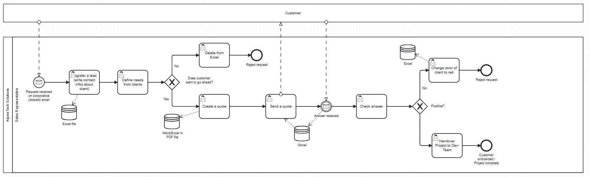

The full process model can be viewed and edited in Camunda Modeler:
[Alpine Tech Solutions — AS-IS process (BPMN)](resources/bpmn_models/Alpine%20Tech%20Solutions_AS-IS%20process.bpmn)

#### Project Focus: Digitalisation of the First Part of the Process

While the AS-IS process covers the entire sales lifecycle, **this project focuses on the digitalisation of the process from the moment a lead request is received through to the creation of a quote**. This scope covers lead registration, lead assignment, consultation scheduling, needs definition, and quote creation — the steps with the highest concentration of manual effort, coordination overhead, and risk of data loss.

---

## 3. Project Objective

The problems identified in the AS-IS process — fragmented data, manual coordination, and lack of visibility — require a structured digitalisation of the sales process. The goal of this project is to automate and centralise the steps **from the moment a lead request is received through to the creation of a quote**, eliminating manual overhead and reducing the risk of data loss.

The solution targets the following outcomes:

- Centralised, real-time lead tracking replacing individual Excel files
- Automated lead assignment based on predefined rules (region, workload)
- Automated scheduling and follow-up reminders to prevent leads from stalling
- Structured quote generation
- Full interaction history accessible to the entire sales team

---

## 4. Digitalisation Approach: AS-IS vs. TO-BE

The table below maps each identified bottleneck from the AS-IS process to its automated counterpart in the TO-BE implementation:

| Process Step | AS-IS (Manual) | TO-BE (Automated) |
| :--- | :--- | :--- |
| **Lead Registration** | Manual entry into individual Excel files; duplicates and data loss common. | Leads captured via contact form and stored instantly in a centralised CRM database via API. |
| **Lead Assignment** | Manual decision by the Sales Manager; slow and inconsistent. | Automatic routing to the responsible Sales Representative using a **DMN decision table** (region / workload). |
| **Consultation Scheduling** | No formal step — slots shared manually by email. | Automated booking link (Cal.com) sent via Gmail; confirmation received via webhook and injected into the process. |
| **Needs Definition** | Information gathered verbally during a call; stored in personal notes or Excel with no shared access. If the Sales Rep was absent, context was lost and the client had to repeat themselves. | A structured **Camunda User Task form** is filled by the Sales Rep during the call. Data is pulled from and saved to the central database, making the full client context available to any team member. The step repeats in a **loop** across multiple interactions until the client confirms their requirements — only then does the process advance to quote creation. |
| **Quote Generation** | Manual creation in Word/Excel, exported to PDF; inconsistent and time-consuming. | Quote generated automatically from a predefined template based on inputs collected during needs definition. |
| **Communication Tracking** | Fragmented Gmail threads; history lost when staff are absent or reassigned. | All interactions logged centrally in the CRM and accessible to the full sales team. |

## 5. TO-BE Process

The TO-BE process replaces the fragmented, manual workflow with a centralised, automated sales pipeline orchestrated through **Camunda BPMN**. The digitised scope covers the full journey from an incoming lead request to the creation of a quote.

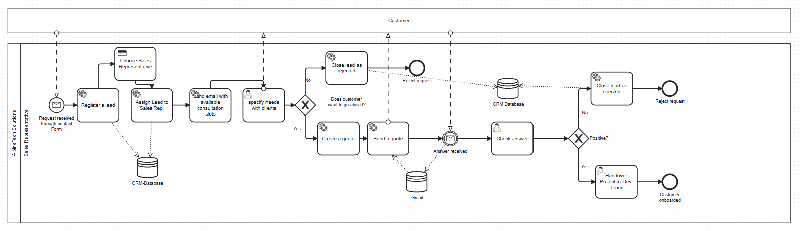

The full TO-BE process model can be viewed and edited in Camunda Modeler:
[Alpine Tech Solutions — TO-BE process (BPMN)](resources/bpmn_models/Alpine%20Tech%20Solutions_TO-BE%20process.bpmn)

---

### 5.1 Register a Lead

#### Overview

The lead registration is the entry point of the digitalized Lead-process. A potential customer who is interested in the company's services submits a contact form. In a production setting this form would be embedded directly in the company website; for this prototype it is implemented as a Google Form. The submission captures the prospect's details and automatically triggers the downstream workflow in Camunda.

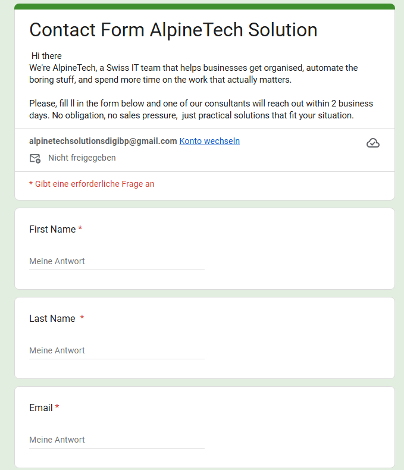

The complete Google Form can be viewed and Submitted [here](https://docs.google.com/forms/d/e/1FAIpQLSdGfdGSBaz-DSek2og8MKrBVoiu1B48YRsy3M5m94WbBHbJmg/viewform).

#### Implementation

The contact form is implemented as a Google Form. The linked Make scenario uses a **Google [Watch Responses] trigger** to detect new submissions. This is
a polling-based trigger: Make checks for new form responses at a fixed interval. Once a new submission is detected, the scenario carries out three steps in sequence:

1. **Customer persistence** – A new record is inserted into the `customer` table of our PostgreSQL database (hosted on Neon). During this step, the free-text region input is normalized into a standardized country code (`ch`, `de`, `at`), so that downstream steps can rely on consistent values.
2. **Lead persistence** – A new record is inserted into the `lead` table and linked to the customer created in the previous step.
3. **Process start** – A REST call is made to the Camunda engine to start a new process instance. The relevant lead and customer data is passed along as process variables, so that subsequent tasks can access it without re-querying the database.

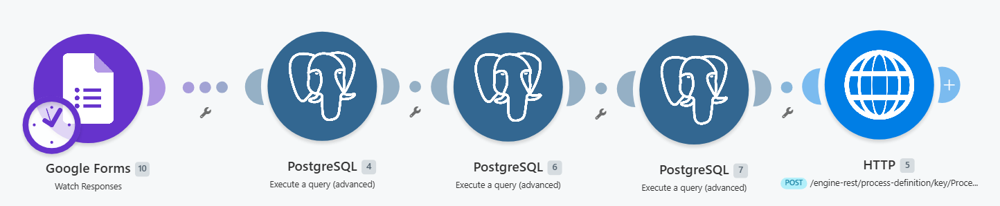

[(Link to Make Scenario)](https://eu1.make.com/public/shared-scenario/vDg2DIatuBN/integration-google-sheets)

From this point onward, the Camunda Lead-process owns and orchestrates the workflow.

#### Design Rationale

**Trigger mechanism — polling vs. event-driven:** Ideally, the process would react to a form submission instantly. We therefore investigated event-driven alternatives, including triggering the scenario directly when a row is added to the linked response spreadsheet. However, we were unable to get the instant trigger working reliably within the project's scope. We therefore use Make's polling-based Google trigger, which checks for new submissions at a fixed interval. For the purpose of this prototype, a short polling delay is an acceptable trade-off: the lead is still processed automatically and without manual intervention, only with a brief latency between submission and process start. A fully event-driven trigger — for example via a Google Apps Script `onFormSubmit` event posting to a Make webhook — is a clear next step for a production deployment.

Customer and lead are stored as **separate records** because they represent different entities: a customer is a company or person, whereas a lead represents a single instance of sales interest. This separation reflects correct data modeling and would, for example, allow a returning customer to generate a second, independent lead.

The **region normalization** is performed once, at insertion time, rather than repeatedly later. This ensures that every downstream consumer — such as the automatic sales representative assignment and the VAT logic during quote creation — can rely on clean, consistent country codes.

Finally, core data is passed to Camunda **as process variables** when the instance is started. This makes the information directly available to later user tasks and forms without additional database lookups.

#### Known Limitations

- **The lead intake is polling-based rather than event-driven.** Make's Google  connector checks for new submissions at a fixed interval, introducing a short latency between form submission and process start. An event-driven trigger (e.g. an Apps Script `onFormSubmit` webhook) would eliminate this latency and is a recommended improvement.
- For the prototype, the Google Form stands in for a form embedded in the company website. The integration pattern would remain identical — the embedded form would post to the same webhook.

---

### 5.2 Choose Sales Representative and Assign Lead

#### Overview

Once a lead has been registered, the process must determine which sales
representative is responsible for it. Rather than relying on manual triage, the assignment is performed automatically based on defined business criteria. This ensures that leads are assigned consistently, immediately, and without a human bottleneck.

#### Implementation

The assignment is implemented as a dedicated Camunda service task ("Choose Sales Representative"), separate from the lead intake. The service task calls its own Make scenario via the API connector. The Make scenario executes a single SQL query against the database that selects the most suitable employee, and then writes the chosen employee onto the lead record via an `UPDATE` statement.

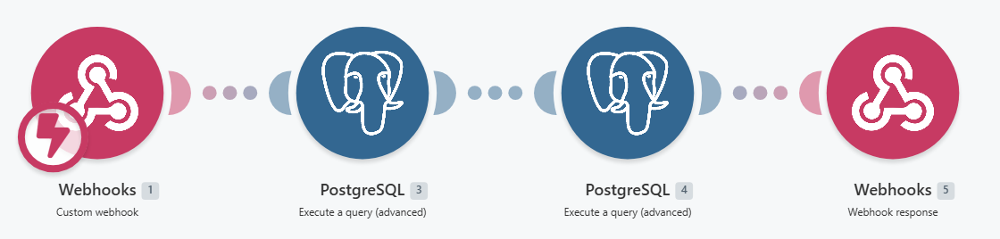

[(Link to Make Scenario)](https://eu1.make.com/public/shared-scenario/jth1Z7T6Afw/lead-assign-employee)

The selection query evaluates all employees and ranks them by three criteria, in
order of priority:

1. **Region match** – the representative operates in the customer's region.
2. **Industry / specialization match** – the representative is specialized in the customer's industry.
3. **Current workload** – as a tie-breaker, the representative with the fewest currently assigned leads is preferred.

Importantly, these criteria are applied as a **ranking**, not as a filter. The query therefore always returns a representative, even if no employee perfectly matches the  region and industry of the customer.

#### Design Rationale

**Why a SQL query instead of Camunda DMN.** Camunda offers DMN (Decision Model and Notation) as a native mechanism for modeling decision logic in decision tables. We deliberately chose not to use DMN for this step. A DMN decision table is well suited to decisions that map a fixed set of *input values* to *output values* through static rules. The sales representative assignment, however, is not a static rule evaluation: it requires querying live data (the set of employees, their specializations, and their current lead counts) and performing a relative ranking across all candidates, including an aggregation (counting assigned leads per employee). This kind of data-driven, comparative selection is naturally expressed in SQL and would be awkward or impossible to express in a DMN table, which has no access to the database and no concept of "rank all rows and pick the best." Using a SQL query keeps the decision logic close to the data it depends on and allows the assignment rules to evolve simply by adjusting the query.

**Why these three criteria, in this order.** Region is prioritized first because a representative should operate within the customer's market. Industry specialization is second, ensuring domain expertise where possible. Workload is used only as a tie-breaker, so that among otherwise equally suitable representatives, leads are distributed evenly and no single representative becomes overloaded.

**Why the query always returns a representative.** The criteria are applied as a ranking rather than a hard filter. If the selection were a strict filter and no employee matched both region and industry, the query would return nothing and the process would stall with an unassigned lead. By ranking instead of filtering, the process always proceeds: a slightly imperfect assignment is preferable to a blocked process instance.

**Why the result is persisted to the lead record.** The chosen representative is written directly onto the `lead` table. The lead record thereby becomes the single source of truth for ownership of the lead, and every subsequent step can reliably determine the responsible representative by reading the lead.

---

### 5.3 Send Email with Available Consultation Slots

#### Overview

Once a sales representative has been assigned, the customer is invited to schedule a first consultation. This is the first direct customer touchpoint and bridges the automated intake with a human conversation. The customer receives a personalized email containing a booking link for their specifically assigned representative.

#### Implementation

The step is implemented as a dedicated Camunda service task, which calls a Make scenario via a webhook. The Make scenario performs the following:

1. Based on the `leadId`, a single SQL query retrieves both the customer's details and the assigned representative's details — including the representative's personal Cal.com booking link, which is stored in the `calcom_link` column of the `employee` table.
2. A personalized invitation email is sent to the customer via the Gmail module. The email addresses the customer by name, names the assigned representative, and contains that representative's Cal.com booking link.

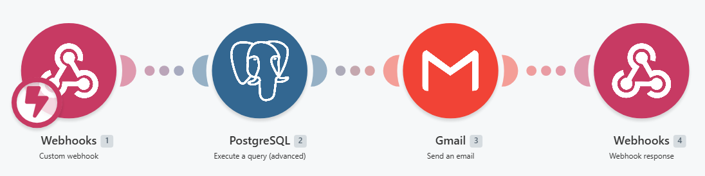

[(Link to Make Scenario)](https://eu1.make.com/public/shared-scenario/78PiU1ChrDC/send-appointment-email)

Each employee has their own Cal.com event type ("Initial Consultation with [Name]"), all hosted under a single shared Cal.com account. The corresponding booking link is stored per employee in the database.

#### Waiting for the Booking — Human Task with a Timer

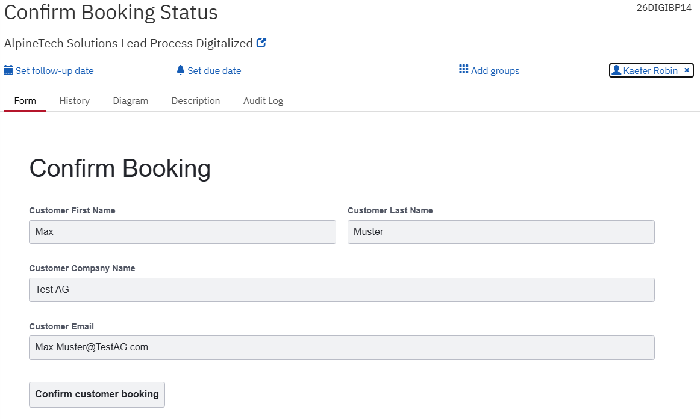

After the invitation has been sent, the process must wait for the customer to react. This is modeled as a **user task** ("Confirm Booking Status") assigned to the sales representative, with an **interrupting boundary timer event** attached.

- If the customer books a consultation, the representative completes the user task
  and the process continues to the needs-clarification phase.
- If no booking occurs, the boundary timer fires after **14 days**, the user task is
  cancelled, and the lead is automatically closed as "unresponsive".

This construct prevents dead process instances: a lead that never responds does not
remain open indefinitely but is automatically closed after a defined period.

#### Design Rationale

**Why one Cal.com account with multiple event types.** For the prototype, all representatives' event types are hosted under a single Cal.com account. This was a pragmatic decision that keeps the setup within the free tier while still presenting each customer with a representative-specific link. Crucially, the data model — one `calcom_link` per employee — is correct independently of this simplification. In a production setting, each representative would have their own calendar, and only the stored links would change; the process itself would remain unaltered.

**Why a manual confirmation instead of automatic booking detection.** Ideally, a booking on Cal.com would be detected automatically (via a Cal.com webhook) and correlated back to the running process instance. We deliberately scoped this out: the fully automated variant requires a webhook integration and message correlation, which adds significant integration complexity. Instead, the sales representative — who is notified of a real booking by Cal.com anyway — manually confirms the booking by completing the user task. The process model already accommodates the automated variant: the user task could later be replaced by a message catch event without restructuring the surrounding flow.

**Why a timer-based timeout.** Without a time limit, a lead whose customer never responds would leave a process instance running forever. The interrupting boundary timer guarantees that unresponsive leads are closed automatically after 14 days, keeping the set of active process instances clean and meaningful.

#### Known Limitations

- Because all event types share a single underlying Cal.com account, they also share availability. This is a cosmetic separation rather than true per-representative scheduling. In production, each representative would have an independent calendar.
- Cal.com event types are provisioned manually for each employee. Adding a new representative requires creating a matching event type and populating the `calcom_link` field. This is acceptable for the fixed roster of the prototype.
- A booking made *after* the 14-day timeout would still reach the representative via Cal.com, but the corresponding lead would already be closed. In the current prototype this edge case is handled manually. The architecturally correct solution would treat a late booking as a returning lead and start a fresh process instance.

---

### 5.4 Specify Needs with Client

#### Overview

After a consultation has been booked, the process enters the needs-clarification phase. During this phase, the sales representative speaks with the customer to understand their requirements. In practice, this rarely happens in a single conversation — several calls or meetings may be necessary before the scope of a potential project is clear. Each of these interactions is logged and persisted in a central database, so that the complete communication history of a lead is always available.

#### Implementation

The needs-clarification phase is modeled as a **loop** in the process. One iteration of the loop consists of the following steps:

1. **Fetch past communications** – A service task calls a Make scenario that  retrieves all previously logged communications for the current lead.
2. **Log Communication (user task)** – The sales representative is presented with a form that displays the past communications and allows them to record a new one.
   The form also allows the representative to correct selected customer details (phone, email, company, company size) that may have become clearer during the conversation.
3. **Persist** – On submission, the new communication is inserted into the `communications` table, and any changes to the editable customer fields are written back to the `customer` table.
4. **Reset input variables** – A script task clears the variables holding the new communication's input, so that the next loop iteration starts with an empty form.
5. **Decision gateway** – An exclusive (XOR) gateway evaluates the `nextStep` variable chosen by the representative and routes the process accordingly.

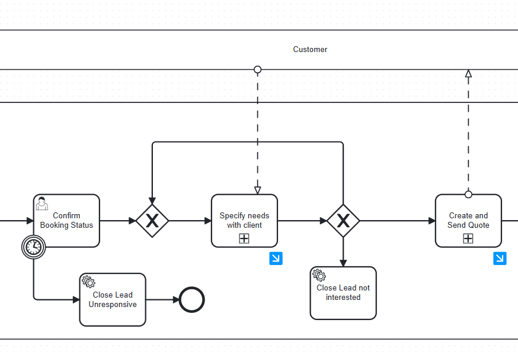

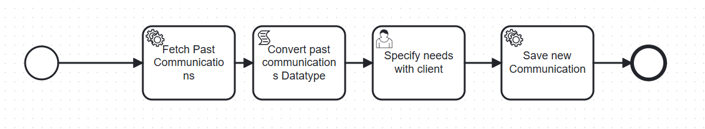

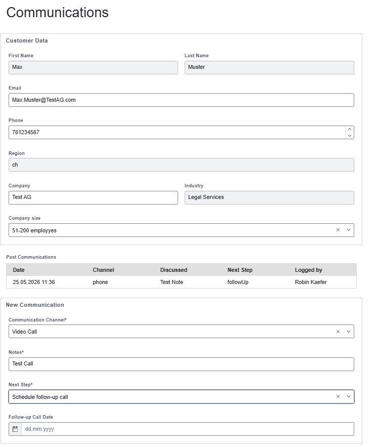

[(Fetch Communications Make Scenario)](https://eu1.make.com/public/shared-scenario/xWS9uv5jaLq/fetch-past-communications)
[(Safe New Communication Make Scenario)](https://eu1.make.com/public/shared-scenario/I4XP9RZkbTY/safe-new-communication)

The decision gateway has three outcomes:

- **`followUp`** – further clarification is needed; the process loops back and another communication is logged.
- **`createQuote`** – the requirements are clear; the process proceeds to quote creation.
- **`closeLead`** – the customer is no longer interested; the lead is closed.

#### Design Rationale

**Why communications are persisted centrally.** A central motivation for digitalizing this process is *continuity*. If all customer communication exists only in the heads or personal inboxes of individual sales representatives, the knowledge is lost the moment that representative is unavailable. By persisting every interaction in a central database, the complete history of a lead is preserved independently of any single person. If a representative falls ill or leaves the company, a colleague can take over the lead with full context.

**Why the history is fetched and displayed back into the form.** Persisting the communications alone is not sufficient to deliver this benefit — the data must also be *visible* to whoever works on the lead. Each iteration of the loop therefore fetches the full history and displays it within the "Log Communication" task. A representative taking over a lead sees all prior interactions directly in their normal workflow, without having to consult the database manually.

**Why the phase is modeled as a loop.** Clarifying a customer's needs is an iterative process; it cannot be assumed to complete in a single conversation. Modeling the phase as a loop allows an arbitrary number of communications to be logged before the process moves on, which reflects how the interaction realistically unfolds.

**Why certain customer fields are editable here.** Over the course of several conversations, a representative naturally learns more about the customer. Allowing selected fields — phone, email, company, and company size — to be corrected during communication logging keeps the customer record accurate, rather than freezing whatever was entered on the initial contact form.

**Why the input variables are reset after each iteration.** Process variables persist for the lifetime of an instance. Without an explicit reset, the input fields of the "Log Communication" form would, on the next loop iteration, still contain the text of the *previous* communication. The reset script task clears these variables so that each new communication is entered into a blank form.

**Why the logging employee is derived from the lead.** Each communication records which employee logged it. Rather than relying on the employee identifier being passed as a process variable, this value is read directly from the `lead` record (via a subquery) at insertion time. The lead already holds the assigned representative, so this is the single reliable source of truth and avoids a dependency on a variable that the connector did not propagate reliably.

#### Known Limitations

- The communication history is displayed in the form using a table component. This works reliably for single-line notes. Multi-line notes (notes containing line breaks) caused the underlying data to be transmitted as invalid JSON, which the table component could not render. The cause couldn't reliably be pinpointed. As a mitigation, communication notes are captured as single-line entries, which prevents the line breaks that trigger the issue.
- A fully robust solution would require a connector that exposes the raw response body for manual parsing, allowing the history to be rendered reliably regardless of note formatting.

---

### 5.5 Create a Quote

The quote creation is the most extensive part of the process. It is triggered when the needs-clarification phase concludes with the decision to create a quote. It is modeled as its own sub-process and covers the assembly of quote data, the generation of a professional PDF document, and its delivery to the customer by email.

#### Overview of the Sub-Process

The "Create and Send Quote" sub-process consists of the following steps:

1. **Fetch past communications** – the communication history of the lead is retrieved and displayed in the quote form as a decision aid for the representative.
2. **Fetch service catalog** – the list of available services is retrieved to populate the quote form.
3. **Enter Quote Details (user task)** – the representative compiles the quote.
4. **Generate and Send Quote** – the quote is persisted, rendered as a PDF, and emailed to the customer.

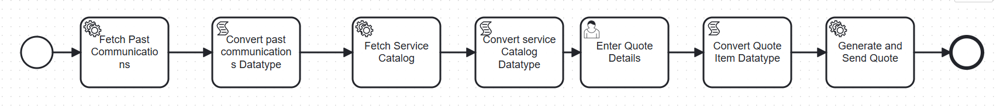

#### Service Catalog and Quote Form

The company's services are stored in a `service_catalog` table — for example developer roles billed per hour, or fixed-price packages such as a discovery workshop. Before the quote form is shown, a service task fetches this catalog so that it can be offered to the representative as a selectable list.

In the "Enter Quote Details" form, the representative provides the project title, a validity date, scope notes, and payment terms. The individual line items of the quote are entered using a **dynamic list** component: the representative can add as many line items as needed, each consisting of a service (chosen from the catalog) and a quantity.

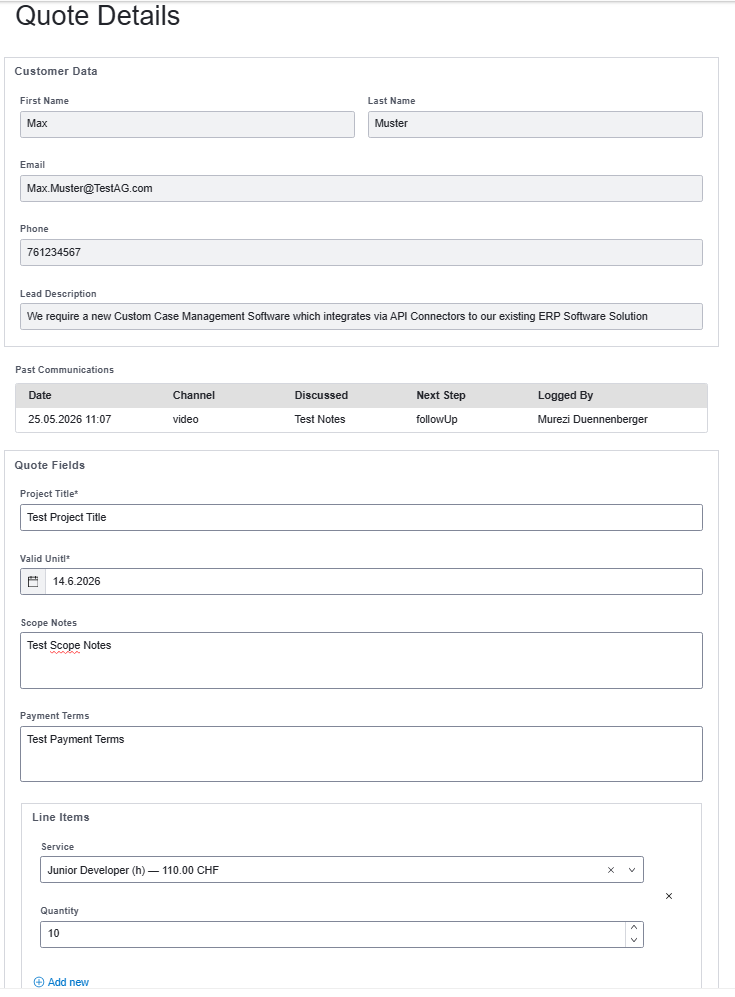

#### Quote Persistence

When the form is submitted, the "Generate and Send Quote" service task calls a Make scenario that persists the quote. The quote header is written to the `quote` table, and each line item to the `quote_item` table. Two values are determined automatically rather than entered by the representative:

- **Quote number** – a sequential, human-readable identifier of the form `Q-YYYY-NNNN` is generated during insertion.
- **Currency and VAT** – these are derived from the customer's country: Swiss customers are billed in CHF with the Swiss VAT rate, while customers in other countries are billed in EUR with a 0% rate and a reverse-charge note.

#### PDF Generation

To produce the actual quote document, the Make scenario first retrieves the persisted quote together with all line items. The monetary totals — subtotal, VAT amount, and gross total — are calculated within this SQL query. The line items are then assembled into an HTML fragment, which is passed, together with all header data, to **CustomJS**, an HTML-to-PDF service. CustomJS renders a professionally formatted PDF quote from a predefined HTML/CSS template.

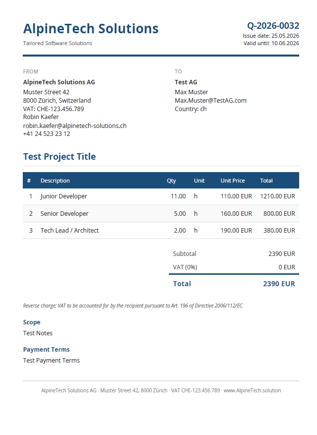

#### Email Delivery

Finally, the generated PDF is sent to the customer as an email attachment via the Gmail module, completing the sub-process.

#### Confirming the Outcome

After the quote has been sent, the process reaches the "Confirm Quote Status" user task. The sales representative records whether the customer accepted the quote. An exclusive gateway then routes the process: if the quote was accepted, the project is handed over to the developer team; if not, the lead is closed.

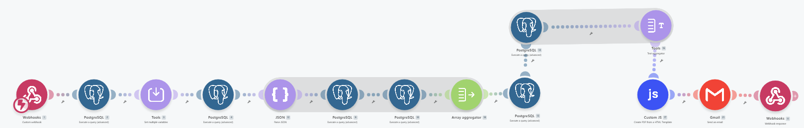

[(Link to Make Scenario)](https://eu1.make.com/public/shared-scenario/mtNCKEDnkRS/insert-quote)

#### Design Rationale

**Why a service catalog instead of free-text line items.** Offering a predefined catalog of services keeps quotes consistent and reduces data-entry effort and error. The representative selects a service and enters a quantity, rather than re-typing descriptions and prices for every quote.

**Why a dynamic list for line items.** The number of line items in a quote is not fixed — a quote may contain one position or many. A dynamic list allows the representative to add exactly as many line items as the quote requires, which a fixed set of input fields could not accommodate cleanly.

**Why currency and VAT are derived rather than entered.** Tax treatment is a rule, not a free choice. Deriving currency and VAT from the customer's country removes a source of human error and ensures every quote is billed consistently. (The implemented VAT logic is a deliberate simplification — see Known Limitations.) 

**Why the totals are calculated in SQL.** The monetary totals are derived values. We chose to compute them within the SQL query that retrieves the quote, rather than storing them in the database or computing them in Make. Computing them on retrieval guarantees the totals are always consistent with the underlying line items and cannot drift out of sync, and it keeps the calculation in a single, well-defined place.

**Why CustomJS for PDF generation.** Generating a professionally formatted PDF requires a dedicated rendering tool. CustomJS converts an HTML/CSS template into a PDF, which allowed us to design the quote layout with standard web technologies. Its free tier was sufficient for the project's needs. Because CustomJS performs only simple placeholder substitution and cannot iterate over a list, the variable-length line items are pre-assembled into an HTML fragment within Make and injected into the template as a single block.

**Why the "Convert ... Datatype" script tasks exist.** Data retrieved from the database and returned through the API connector is not always delivered in a format that Camunda's form components can process directly. The interleaved script tasks convert these values into the required JSON format so that they can be used in the subsequent forms.

### Known Limitations

- The VAT logic is a deliberate simplification. It distinguishes Swiss customers from all others but does not implement the full set of international tax rules. As taxation was not the focus of this project, an approximation was considered sufficient.
- The communication history shown in the quote form does not include the most recently logged communication. The history is fetched at the start of the sub-process, and the latest entry is not yet reflected. As this history serves only as a decision aid and does not affect the generated quote, the issue was accepted for the prototype.
- The process supports the creation of new quotes but not the revision of an existing quote. A revision would currently require creating a new quote.

---

